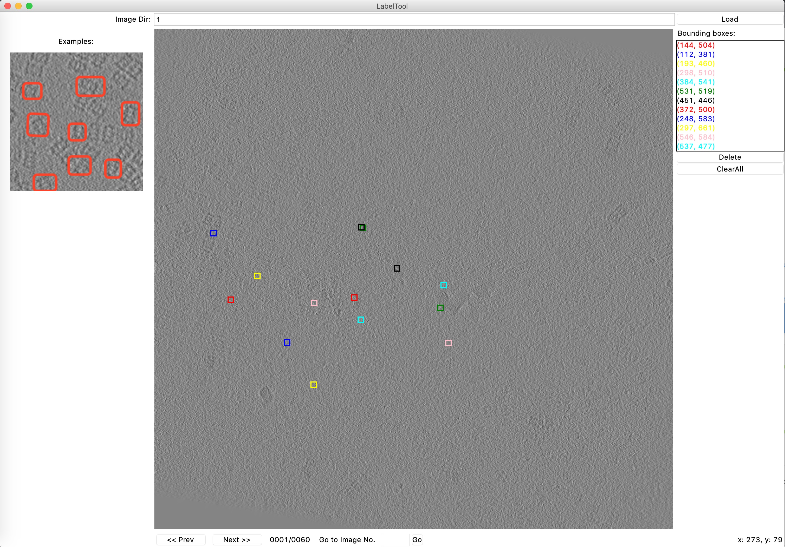

Label-Tomo
===============

Code for labeling tomo particle center in images and plotting figures.

**Screenshot:**


Data Organization
-----------------
LabelTool  
|  
|--main.py   *#  code for labeling*  
|--plot.py   *#  code for the plotting*  
|--extractimg.py   *#  code for extracting image from tomography*  
|  
|--Images/   *# direcotry containing the images to be labeled*  
|  
|--Labels/   *# direcotry for the labeling results*  
|  
|--Examples/  *# direcotry for the example bboxes*  

Environment
----------
- python 2.7
- python PIL (Pillow)
- matplotlib

Run
-------
### 1.Extracting Imge plane from \*.mrc file into Images\/001 folder
```python
$ python extractimg.py --mrc xxx.mrc
# Specific a folder
$ python extractimg.py --mrc xxx.mrc --dir 001
# Specific a region on Z axes
$ python extractimg.py --mrc xxx.mrc --i 80 --j 140
```

### 2. Label particles
```python
$ python main.py
```

### 3.Plotting
``` python
$ python plot.py --dir 001
```
